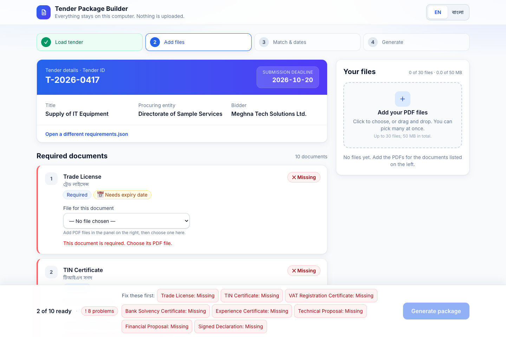
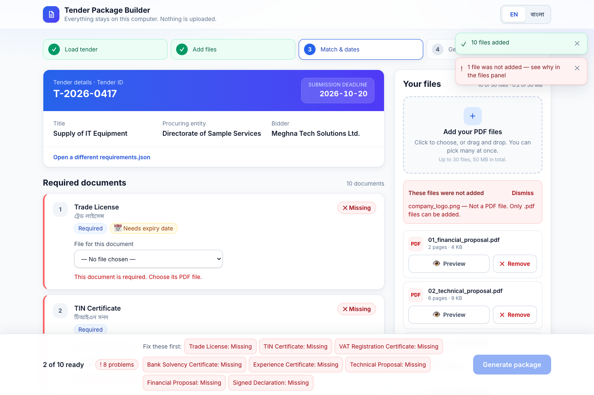
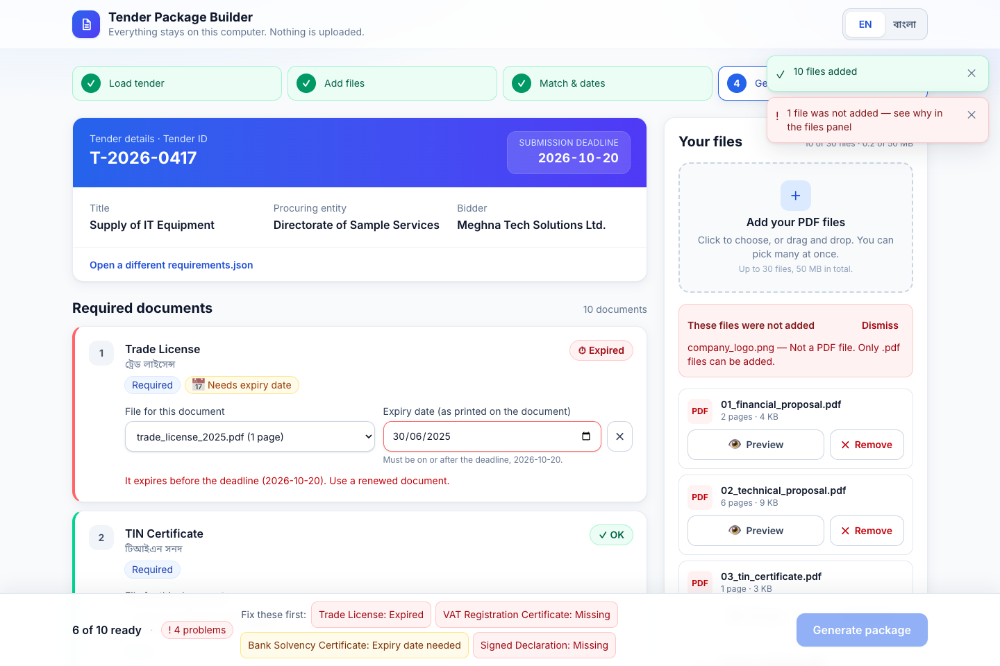
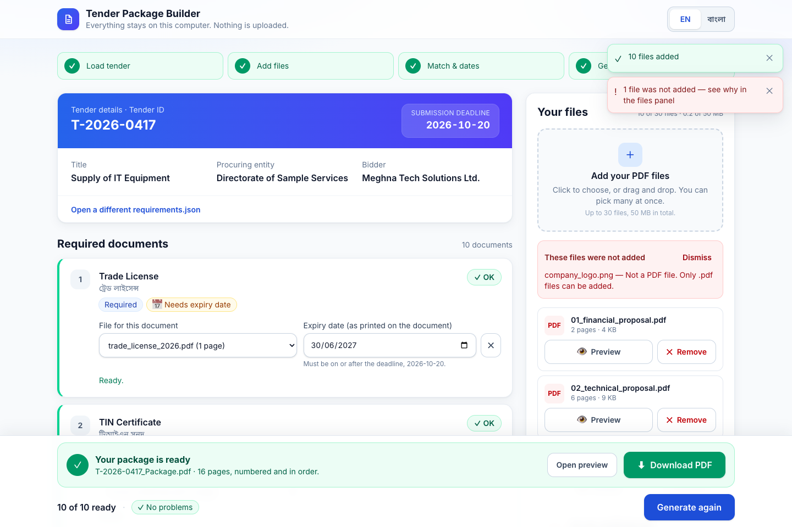
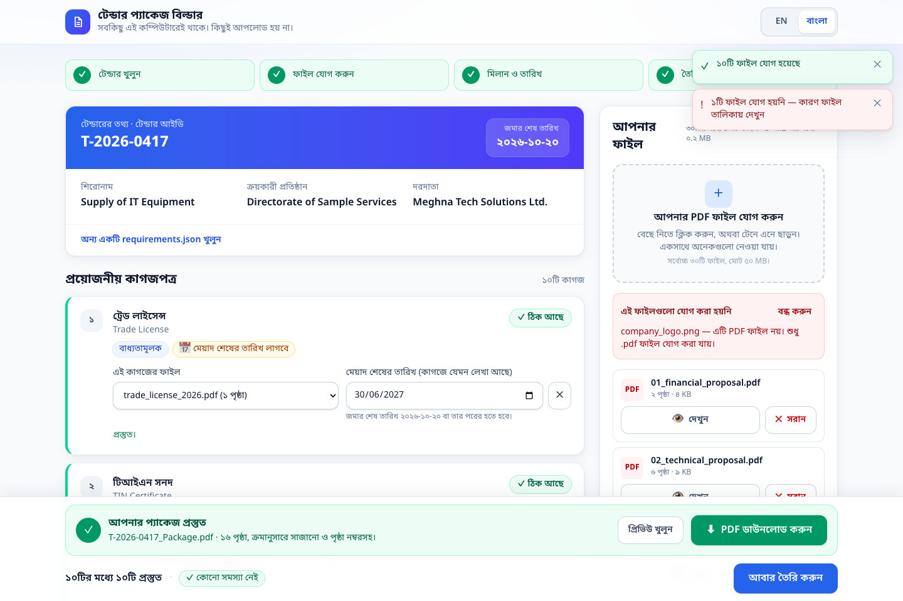

# Tender Document Package Builder

> Build one ordered, page-numbered tender submission PDF package entirely in your browser. Fast, local, private. Nothing is uploaded to any server.

Built for the **AI DevFest 2026** contest.

---

## Live Demo & Offline Ready

- **Live URL:** [GitHub Pages App](https://jaherunhasanrimon.github.io/devfest--241-15-914-/)
- **Zero Backend / Zero CDN:** All logic runs client-side in Google Chrome / modern browsers. Fonts (Inter, Noto Sans Bengali, Noto Sans TTF) are bundled locally. Works completely offline.

---

## Key Features

1. **Robust JSON Tender Ingestion:**
   - Validates `requirements.json` structure, tender metadata fields, and ISO dates (`YYYY-MM-DD`).
   - Stable numeric sorting by requirement `order` (handles strings or numbers, preserving original order on ties).
   - Friendly, localized error explanations for malformed or incomplete data (never crashes).
2. **File Upload & Validation:**
   - Multi-file drag & drop and file picker.
   - Dual-layer PDF validation: checks both `.pdf` extension AND `%PDF-` magic header bytes.
   - Rejects password-protected (encrypted) or damaged files with clear error messages.
   - Enforces contest safety limits: maximum 30 files, 50 MB total.
   - In-browser instant preview for each uploaded document via blob URL in a new tab.
3. **Strict 1:1 Matching & Expiry Management:**
   - Enforced directly in the state reducer: a file may be matched to at most one requirement.
   - SHA-256 duplicate detection: duplicates are badged (`Duplicate of ...`), and a duplicate group may be matched to at most one requirement across the whole tender.
   - Dynamic expiry inputs: appears only when a requirement has an expiry date and a file is selected.
   - Changing or removing a file automatically clears the associated expiry date.
4. **Deterministic Status Engine:**
   - **Missing (✕ Red, Blocker):** Mandatory requirement with no file assigned.
   - **Expiry date needed (⚠ Amber, Blocker):** Requirement requires expiry date, file matched, but no date entered.
   - **Expired (⏱ Red, Blocker):** Expiry date is before the tender submission deadline (`expiry < deadline`). Same-day (`expiry == deadline`) is accepted as OK.
   - **Not provided (– Gray, Non-blocker):** Optional requirement with no file assigned.
   - **OK (✓ Green):** File matched, and expiry is on or after the deadline.
   - Lexicographical ISO string comparison prevents timezone skew bugs.
5. **Compliant PDF Generation (`buildPackage`):**
   - **Page 1: English Cover Sheet:** Tender ID, Title, Procuring Entity, Bidder, Submission Deadline, Date Prepared, and ordered list of included documents.
   - **Guaranteed 1-Page Cover:** Dynamic typography and 2-column layout ensure up to 30 documents with long titles fit strictly on Page 1.
   - **Non-Overlapping Footer Strip:** Dynamically expands `MediaBox` and `CropBox` by 30pt at the visual bottom of each page (honoring rotation `0°`, `90°`, `180°`, `270°` and varied page sizes), ensuring `<tender_id> | Page X of Y` is always legible and never covers existing document content.
   - Sanitized filename: downloads as `<tender_id>_Package.pdf`.
6. **Bilingual Support (English & বাংলা):**
   - Instant language switch persisting across reloads (`localStorage`).
   - Bengali digits (০-৯), localized requirement titles (`title_bn` with fallback to `title_en`), and complete microcopy translated.

---

## Project Structure

```
├── docs/                 # Memory docs: architecture.md, phases.md, design.md
├── src/
│   ├── core/             # Pure TypeScript core logic (no DOM / React dependencies)
│   │   ├── types.ts          # Core domain types
│   │   ├── tender.ts         # requirements.json validation & sorting
│   │   ├── files.ts          # Extension, magic bytes, SHA-256, duplicates, limits
│   │   ├── matching.ts       # 1:1 and duplicate group matching constraints
│   │   ├── status.ts         # Deterministic status computation
│   │   ├── buildPackage.ts   # pdf-lib PDF assembly, cover & rotation-aware footer
│   │   └── *.test.ts         # Vitest unit test suites
│   ├── state/            # useReducer state management & AppContext
│   ├── i18n/             # Complete EN and BN dictionaries
│   ├── ui/               # Modular accessible UI components
│   └── assets/fonts/     # Bundled Noto Sans TTF for cover generation
├── scripts/
│   ├── inspect-pack.mjs  # Inspects sample pack without dumping PDF text
│   └── verify-package.mjs# pdfjs-dist verification of generated PDF geometry & footers
├── screenshots/          # High-resolution application screenshots
└── output/               # Verified generated test outputs
```

---

## Quickstart

### Prerequisites
- Node.js 18+ (tested on Node 22 & 25)
- npm

### Installation & Development
```bash
# Install dependencies
npm install

# Run Vitest test suite
npm test

# Start local development server
npm run dev
```

### Production Build & Verification
```bash
# Typecheck & build bundle
npm run build

# Preview production build locally
npm run preview
```

### Automated Package Verification
To verify the generated package using `pdfjs-dist`:
```bash
node scripts/verify-package.mjs output/T-2026-0417_Package.pdf T-2026-0417 16
```

---

## Screenshots

| 1. Tender Loaded | 2. Upload & Duplicates |
| :---: | :---: |
|  |  |

| 3. Status Validation & Blockers | 4. Generated Success Card |
| :---: | :---: |
|  |  |

| 5. Full বাংলা (Bengali) Interface |
| :---: |
|  |

---

## Contest Verification Summary

- **Sample Pack Requirements:** 10 requirements (8 mandatory, 2 optional).
- **Files Matched:** 8 valid files (R06 and R07 optional skipped).
- **Total Pages:** 1 cover + 15 document pages = **16 pages** (`T-2026-0417_Package.pdf`).
- **Footer Integrity:** Every page includes `T-2026-0417 | Page X of 16` in ≥10pt dark font inside the extended white bottom margin, verified by automated script to have 0 text overlaps.
